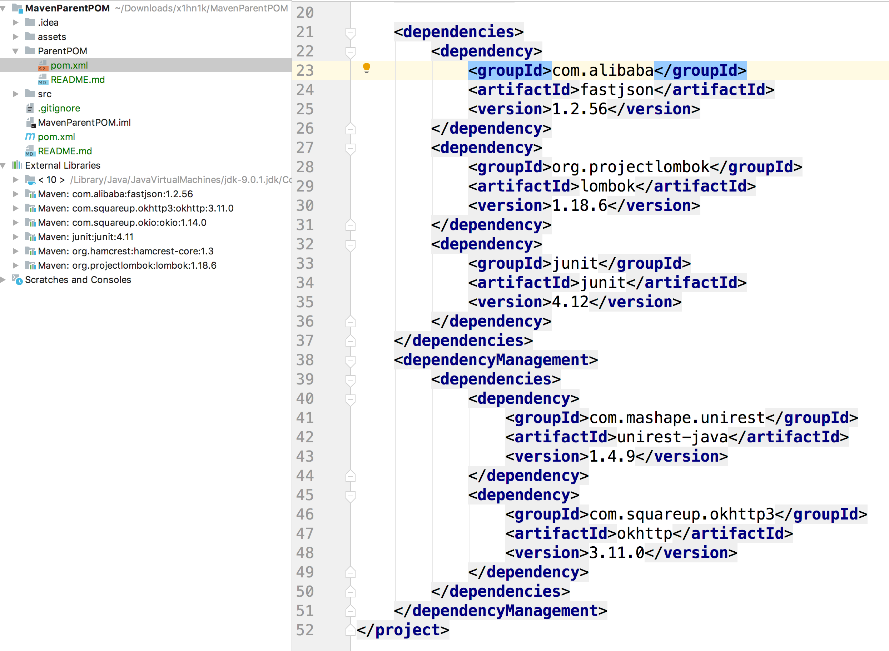
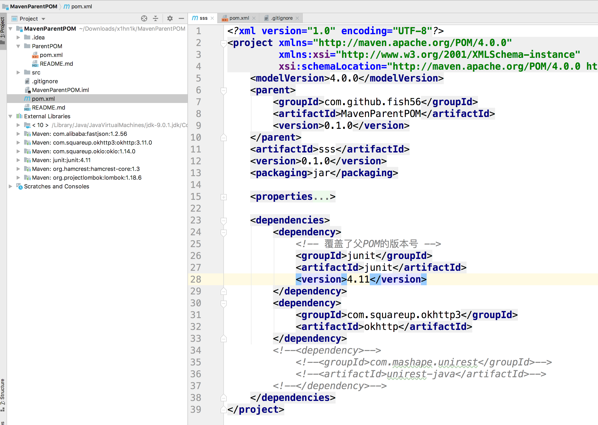

# Maven POM 文件的继承关系

1. 父POM的`dependencies`会被子模块全盘继承。

   就将相当于子模块中复制粘贴了一份。
   如果子子模块中重新定义了相同GA( groupId + artifactId) 的依赖，那么子模块的版本号会覆盖父模块的。

2. `<dependencyManagement>`

   子模块想继承父模块这里面的依赖，需要声明GA，然后就可以继承父模块的版本号了。

   这样做的意义是避免依赖冲突。比如SpringBoot 父POM中定义近千个依赖，它们是经过Spring官方团队充分测试的，不会出现依赖冲突。

### 实例

这是一个父子项目的实例，父POM定义在`./ParentPOM`这个文件夹。

这个是父POM：

这个是子POM：

通过IDEA的智能提醒我们可以看到：

1. 子模块直接继承了父模块的fastjson 和 lombok这两个依赖
2. junit也继承了，但是子模块中重新定义了依赖，所以父模块的版本号被继承了
3. unirest被父模块定义在`<dependencyManagement>`，所以子模块没有能够继承
4. 但是子模块可以通过定义GA继承父模块`<dependencyManagement>`中依赖的版本号。我们子模块的okhttp没有写版本号但是依旧能过正常运行因为它从父模块中继承了版本号